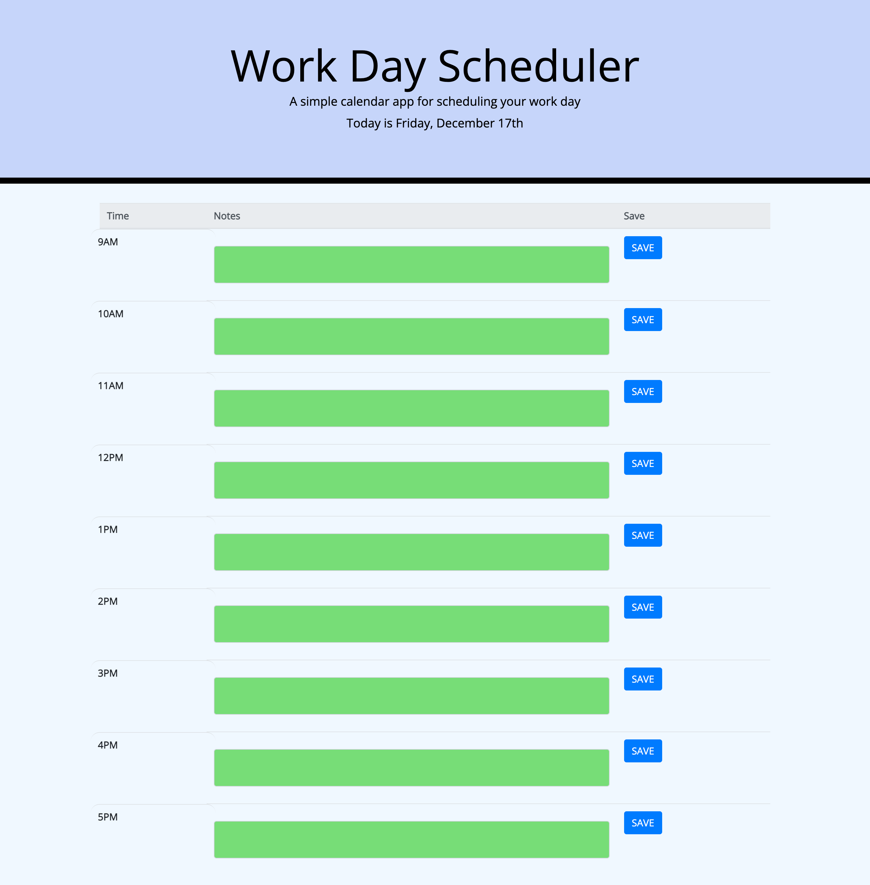

# day-planner
## Description

This project was to create a work day scheduler and planner that was formatted as a simple 9 hour calendar block on a webpage.  The app was designed to run in the browser and features dynamically updated HTML and CSS powered by jQuery.  The Moment.js library was used to work with dates and times and to populate that information on the page.

- [Installation](#installation)
- [Usage](#usage)
- [Credits](#credits)
- [License](#license)

## Installation

The files along with the assets folder were deployed using GitHub Pages and can be used to open up the webpage. The quiz is hosted through GitHub pages, at: https://danielwestiner.github.io/code-quiz/ The indivial files can be accessed through my personal GitHub repository located: https://github.com/DanielWestiner/code-quiz

## Usage

The files can be viewed using any desktop browser for viewing.
The navigation can be used to browse different sections and will be updated as they become populated with projects.

## Credits

Collaborators on this project include the UPENN bootcamp cohort, teaching staff, and tutor Alexis San Javier who helped make edits to this project. Some concepts and syntax tips were learned from Colt Steele and his Udemy Bootcamp course. Animal trivia questions were obtained from http://www.opinionstage.com/blog/trivia-questions

## License

MIT License

Copyright (c) [2021] [Daniel Westiner]

Permission is hereby granted, free of charge, to any person obtaining a copy
of this software and associated documentation files (the "Software"), to deal
in the Software without restriction, including without limitation the rights
to use, copy, modify, merge, publish, distribute, sublicense, and/or sell
copies of the Software, and to permit persons to whom the Software is
furnished to do so, subject to the following conditions:

The above copyright notice and this permission notice shall be included in all
copies or substantial portions of the Software.

---
